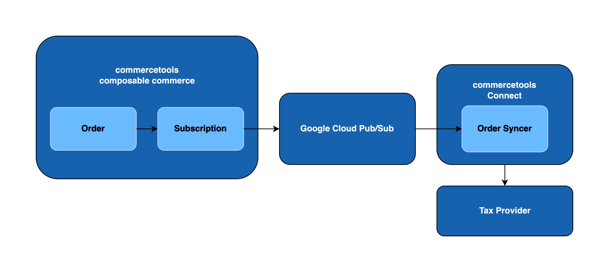

# Order Syncer
This module provides an application based on [commercetools Connect](https://docs.commercetools.com/connect), which receives messages from commercetools project once there is an order created. The corresponding order details are then synchronized to the external tax provider.

The module also provides scripts for post-deployment and pre-undeployment action. After deployment via connect service completed, [commercetools Subscription](https://docs.commercetools.com/api/projects/subscriptions) is created by post-deployment script which listen to any order creation in commercetools Project. Once order has been created, the commercetools Subscription sends message to Google Cloud Pub/Sub topic and then notify the order syncer to handle the corresponding changes.

The commercetools Subscription would be cleared once the tax integration connector is undeployed.


## Get started
#### Change the key of commercetools Subscription
Please specify your desired key for creation of commercetools Subscription [here](https://github.com/commercetools/connect-tax-integration-template/blob/dbdce163f08b36d8635d7705dd58c89d03bf8399/order-syncer/src/constants/connectors.constants.js#L3).
The default key is 'ct-connect-tax-integration-order-change-subscription'.

#### Install your tax-provider SDK 
Please run following npm command under order-syncer folder to install the NodeJS SDK provided by tax provider.

```
$ npm install <tax-provider-sdk>
```
#### Install dependencies
```
$ npm install
```
#### Run unit test
```
$ npm run test:unit
```
#### Run integration test
```
$ npm run test:integration
```
#### Run the application in local environment
```
$ npm run start
```
#### Run post-deploy script in local environment
```
$ npm run connector:post-deploy
```
#### Run pre-undeploy script in local environment
```
$ npm run connector:pre-undeploy
```

## Development in local environment
Different from staging and production environments, in which the out-of-the-box setup and variables have been set by connect service during deployment, the order-syncer requires additional operations in local environment for development.
#### Create Google Cloud pub/sub topic and subscription
When an event-type connector application is deployed via connect service, a GCP pub/sub topic and subscription are created automatically. However it does not apply on local environment. To develop the order-syncer in local environment, you need to follow the steps below:
1. Create a Pub/Sub topic and subscription in Google Cloud platform.
2. Use HTTP tunnel tools like [ngrok](https://ngrok.com/docs/getting-started) to expose your local development server to internet.
3. Set the URL provided by the tunnel tool as the destination of GCP subscription, so that message can be forwarded to the order-syncer in your local environment.

For details, please refer to the [Overview of the GCP Pub/Sub service](https://cloud.google.com/pubsub/docs/pubsub-basics).

#### Set the required environment variables

Before starting the development, we advise users to create a .env file in order to help them in local development.
      
For that, we also have a template file .env.example with the required environment variables for the project to run successfully. To make it work, rename the file from `.env.example` to `.env`. Remember to fill the variables with your values.

In addition, following two environment variables in `.env.example` are not needed to be provided by users during staging or production deployment. 
```
CONNECT_GCP_TOPIC_NAME=<your-gcp-topic-name>
CONNECT_GCP_PROJECT_ID=<your-gcp-project-id>
```
It is because they are only required in local development server. For staging or production environment, connect service sets the Pub/Sub topic name and GCP project ID into these environment variables automatically after the Pub/Sub service has been created in Google Cloud platform. 